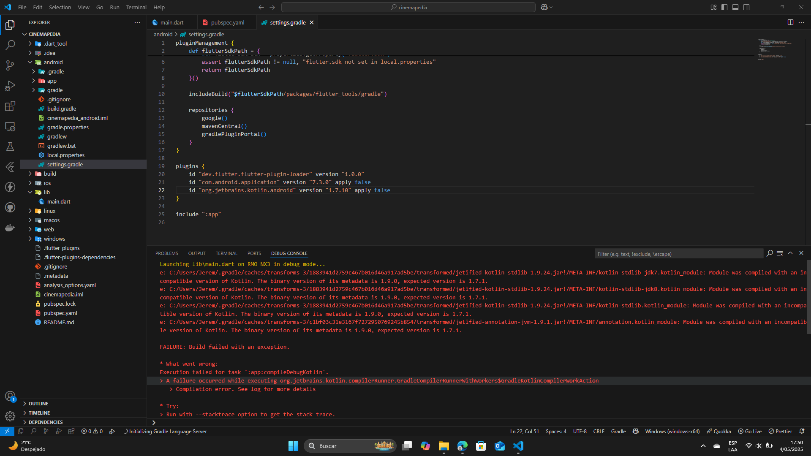

# cinemapedia

# Dev

1. Copiar el .env.template y renombrarlo a .env
2. Cambiar las variables de entorno (The MovieDB)
3. Cambios en la entidad, hay que ejecutar el comando
```
dart run build_runner build
```

# Recomendaciones

1. Tener Android Studio Koala 2024.1.1.12
2. Tener Flutter SDK 3.24.0 - Dart 3.5.0
3. Sí tienes errores al compilar cambia en el setting.gradle: id "org.jetbrains.kotlin.android" version "1.7.10" apply false por "1.9.0"



## Preview


